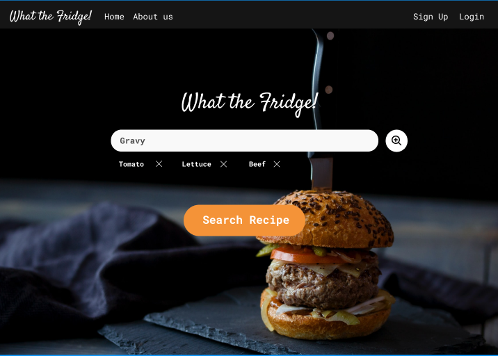

# What The Fridge!

Github link: https://github.com/sultan179/What-The-Fridge

;

--- 

### Table of Contents

- [Description](#description)
- [How To Use](#how-to-use)
- [References](#references)
- [License](#license)
- [Contributors](#contributors-info)

---

## Description

We are creating a Web App called "What the Fridge!" for University of Calgary students to help find recipes based on the student's ingredients. This would result in students expanding their recipe options when they lack ingredients. Our web app will also allow users to post their recipes and leave ratings and reviews on others. We can create a community through the recipes our app can share with this. Users will be able to tell if a recipe is worth their time or not with the help of the ratings. Also, commenting can allow users to share any customizations to recipes they prefer. Cooking can be tedious, especially when individuals do not know what to make. With the help of What the Fridge, students will no longer need to ask, "What should I make?"

## Technologies Used

 
 

### Front end

### Backend

[Back To The Top](#read-me-template)

---

## How To Use

In the route directory of this folder, type:

1. "npm i -y" - to install all neccessary packages for this project
2. "nodemon start" or "node app.js" - to start the server for this project
3. Open the browser prefferably Google Chrome and go to "localhost:3000".
4. Enjoy :)

#### Installation

- Node.js

[Back To The Top](#read-me-template)

---

## References

The project structure: 
https://www.youtube.com/watch?v=99sJapTzRnI&list=PLa5qVXTT08DXFgJhJrdvTJVoVn7azdTDQ&ab_channel=TechSchool_ColtSteele
https://stackoverflow.com/questions/5999118/how-can-i-add-or-update-a-query-string-parameter
https://stackoverflow.com/questions/29238060/how-to-use-same-the-form-for-post-and-put-requests-using-ejs
https://getbootstrap.com/

Starability:
https://github.com/LunarLogic/starability

Heart code:
https://codepen.io/bojandevic/pen/mxKZqK 

Markdown Read.Me
https://www.youtube.com/watch?v=HUBNt18RFbo&ab_channel=TraversyMedia

Signup image verification:
https://thewebdev.info/2021/08/15/how-to-verify-that-an-url-is-an-image-url-with-javascript/

[Back To The Top](#read-me-template)

---

## Example Searchs and Users

Some pre-existing Users you can use are:

- Username: will
- Password: will

- Username: matt
- Password: 123

Some example ingredient search to get the best results are:

- Cheese, Bread
- Cheese, Beef
- Chicken
- Egg
- Beef
- Salt
- Cheese

## License

MIT License

Copyright (c) [2017] [James Q Quick]

Permission is hereby granted, free of charge, to any person obtaining a copy
of this software and associated documentation files (the "Software"), to deal
in the Software without restriction, including without limitation the rights
to use, copy, modify, merge, publish, distribute, sublicense, and/or sell
copies of the Software, and to permit persons to whom the Software is
furnished to do so, subject to the following conditions:

The above copyright notice and this permission notice shall be included in all
copies or substantial portions of the Software.

THE SOFTWARE IS PROVIDED "AS IS", WITHOUT WARRANTY OF ANY KIND, EXPRESS OR
IMPLIED, INCLUDING BUT NOT LIMITED TO THE WARRANTIES OF MERCHANTABILITY,
FITNESS FOR A PARTICULAR PURPOSE AND NONINFRINGEMENT. IN NO EVENT SHALL THE
AUTHORS OR COPYRIGHT HOLDERS BE LIABLE FOR ANY CLAIM, DAMAGES OR OTHER
LIABILITY, WHETHER IN AN ACTION OF CONTRACT, TORT OR OTHERWISE, ARISING FROM,
OUT OF OR IN CONNECTION WITH THE SOFTWARE OR THE USE OR OTHER DEALINGS IN THE
SOFTWARE.

[Back To The Top](#read-me-template)

---

## Contributers

- Sultan Arafat
- Matthew Forman
- Jin Sato
- Will Kerr

[Back To The Top](#read-me-template)
